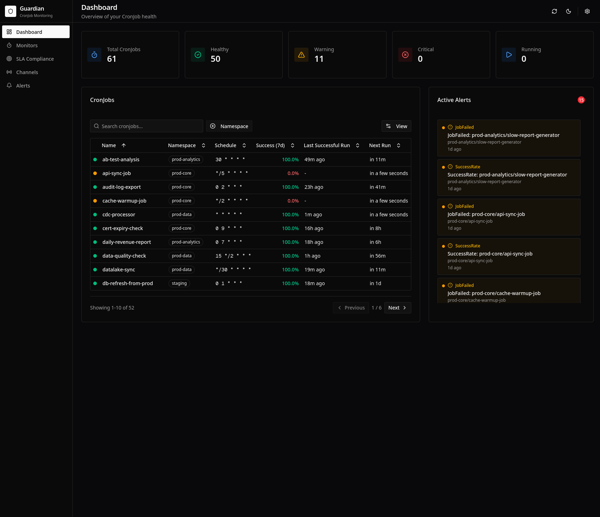
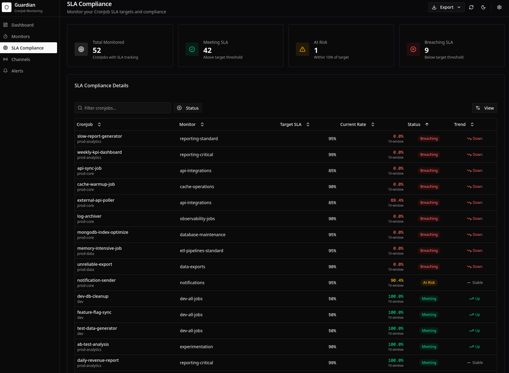

# CronJob Guardian

[](https://github.com/iLLeniumStudios/cronjob-guardian/releases/latest)
[](https://github.com/iLLeniumStudios/cronjob-guardian/actions/workflows/ci.yaml)
[](https://go.dev/)
[](https://goreportcard.com/report/github.com/iLLeniumStudios/cronjob-guardian)
[](https://github.com/iLLeniumStudios/cronjob-guardian/blob/main/LICENSE)

A Kubernetes operator for monitoring CronJobs with SLA tracking, intelligent alerting, and a built-in dashboard.

**[Documentation](https://illeniumstudios.github.io/cronjob-guardian/)** | **[Examples](examples/)**

## Why CronJob Guardian?

CronJobs power critical operations—backups, ETL pipelines, reports—but Kubernetes provides no built-in monitoring for them. When jobs fail silently or stop running, you only find out when it's too late.

CronJob Guardian watches your CronJobs and alerts you when something goes wrong.

## Screenshots

| Dashboard | CronJob Details | SLA Compliance |
|-----------|-----------------|----------------|
|  |  |  |

## Features

- **Dead-Man's Switch** — Alert when CronJobs don't run within expected windows
- **SLA Tracking** — Monitor success rates, duration percentiles (P50/P95/P99), detect regressions
- **Intelligent Alerts** — Rich context with pod logs, events, and suggested fixes
- **Multiple Channels** — Slack, PagerDuty, webhooks, email
- **Built-in Dashboard** — Feature-rich web UI with charts, heatmaps, and exports
- **Prometheus Metrics** — Export metrics for existing monitoring infrastructure

## Quick Start

### Install

```bash
helm install cronjob-guardian oci://ghcr.io/illeniumstudios/charts/cronjob-guardian \
  --namespace cronjob-guardian \
  --create-namespace
```

### Set Up Alerts (Optional)

Create a Slack webhook secret and AlertChannel:

```bash
kubectl create secret generic slack-webhook \
  --namespace cronjob-guardian \
  --from-literal=url=https://hooks.slack.com/services/YOUR/WEBHOOK/URL
```

```yaml
# slack-channel.yaml
apiVersion: guardian.illenium.net/v1alpha1
kind: AlertChannel
metadata:
  name: slack-alerts
  namespace: cronjob-guardian
spec:
  type: slack
  slack:
    webhookSecretRef:
      name: slack-webhook
      namespace: cronjob-guardian
      key: url
```

```bash
kubectl apply -f slack-channel.yaml
```

### Monitor All CronJobs in a Namespace

```yaml
# monitor-namespace.yaml
apiVersion: guardian.illenium.net/v1alpha1
kind: CronJobMonitor
metadata:
  name: all-cronjobs
  namespace: default  # namespace to monitor
spec:
  selector: {}  # empty selector = all CronJobs in this namespace
  deadManSwitch:
    enabled: true
    autoFromSchedule:
      enabled: true
  alerting:
    channelRefs:
      - name: slack-alerts
```

```bash
kubectl apply -f monitor-namespace.yaml
```

### Monitor All CronJobs Cluster-Wide

```yaml
# monitor-cluster.yaml
apiVersion: guardian.illenium.net/v1alpha1
kind: CronJobMonitor
metadata:
  name: all-cluster-cronjobs
  namespace: cronjob-guardian
spec:
  selector:
    allNamespaces: true
  deadManSwitch:
    enabled: true
    autoFromSchedule:
      enabled: true
  alerting:
    channelRefs:
      - name: slack-alerts
```

```bash
kubectl apply -f monitor-cluster.yaml
```

### Access the Dashboard

```bash
kubectl port-forward -n cronjob-guardian svc/cronjob-guardian 8080:8080
```

Open http://localhost:8080

## Configuration Options

The CronJobMonitor CRD supports many options for fine-tuning your monitoring:

| Feature | Description |
|---------|-------------|
| **SLA Thresholds** | Set minimum success rates and maximum durations |
| **Duration Regression** | Alert when jobs slow down over time |
| **Maintenance Windows** | Suppress alerts during planned downtime |
| **Severity Routing** | Route critical vs warning alerts to different channels |
| **Custom Fix Patterns** | Define application-specific troubleshooting suggestions |

See the **[full documentation](https://illeniumstudios.github.io/cronjob-guardian/)** for complete configuration reference.

## More Examples

The [examples/](examples/) directory contains ready-to-use configurations:

- **[monitors/](examples/monitors/)** — CronJobMonitor patterns for various use cases
- **[alertchannels/](examples/alertchannels/)** — Slack, PagerDuty, webhook, email configs
- **[cronjobs/](examples/cronjobs/)** — Sample CronJobs with best practices

## Development

```bash
# Build
make build

# Run locally
make install  # Install CRDs
make run      # Run operator

# Test
make test
make test-e2e
```

## Uninstall

```bash
helm uninstall cronjob-guardian --namespace cronjob-guardian
kubectl delete namespace cronjob-guardian
```

## Contributing

Contributions are welcome! Please feel free to submit issues and pull requests.

## License

Apache License 2.0. See [LICENSE](LICENSE) for details.
